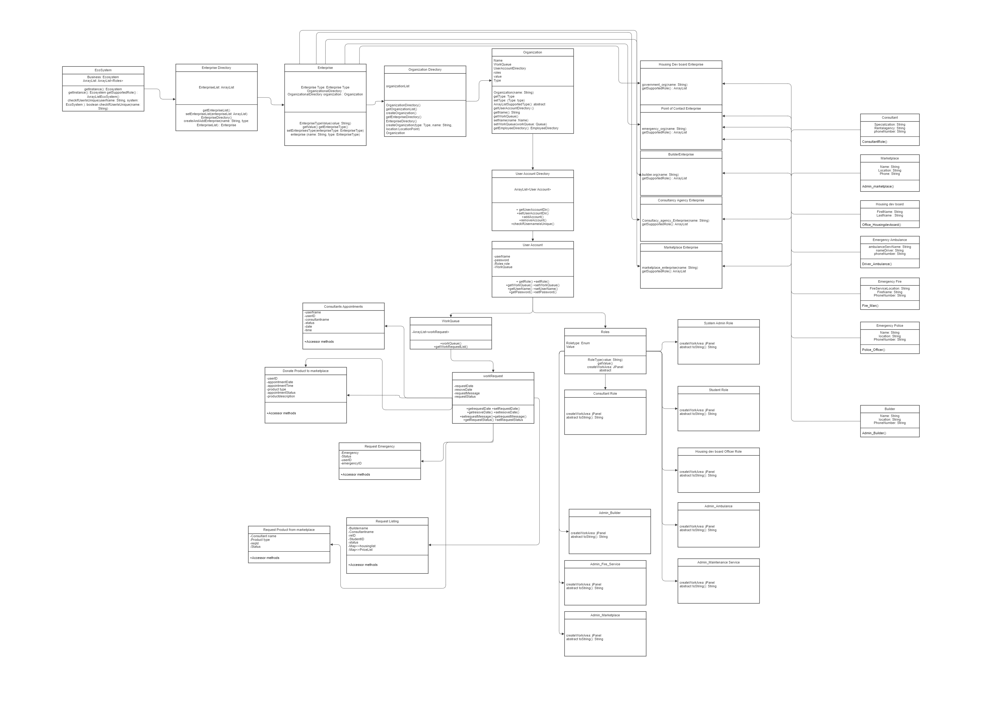
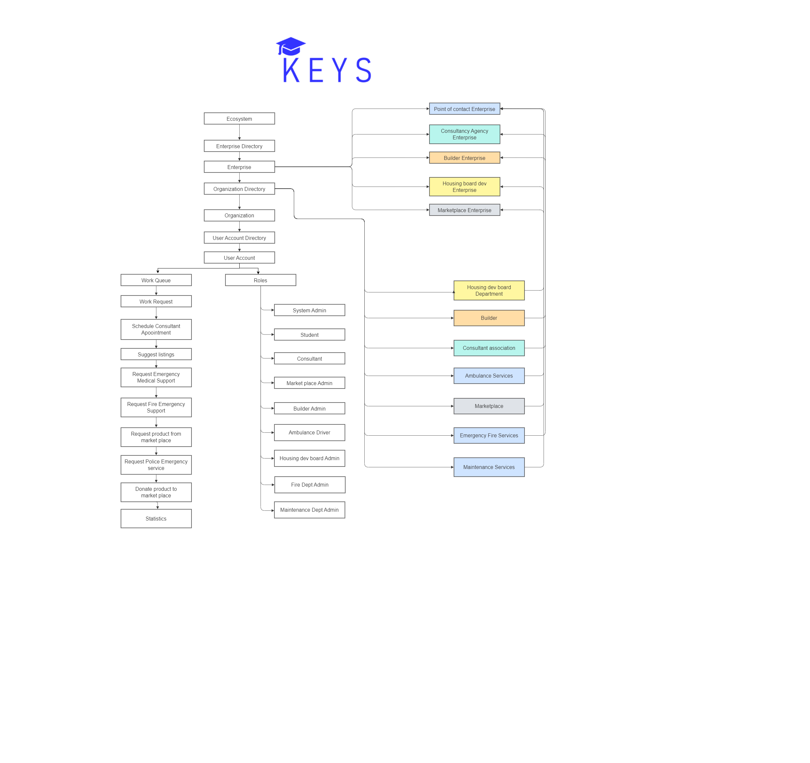

# Keys - Student Accommodation Application 

## Implementation of the JAVA Application to build a Student Accommodation System using the Java Swing Application

### The application is designed for a Student looking for accommodations during their stay. The student has to register as a user of the application, wherein he can consult with the consultant and look for accommodation, and furniture and even use the application after moving into the house as a medium to contact the emergency numbers

### The process flow of the application 
-	The student signs in as a user of the application 
-	The user books an appointment with the consultant 
-	Once the appointment is booked, the consultant will make note of all the requirements specified by the user 
-	The consultant requests builders for the listing based on the user's requirement 
-	Builder will provide the available listings based on the user requirements to the consultant.
-	The Consultant will revert to the user with the listings provided by the Builder 
-	The User gets an option to go through the provided listings and selects a house 
-	Builder approves the user request based on the availability and sends an update to the User
-	After leasing out the house, the user connects with the consultant for the furniture through an appointment and discusses the furniture requirement 
-	The consultant will connect with the marketplace and provide the list of the requirements to the marketplace 
-	The marketplace will validate the stocks in inventory and provide an update to the consultant 
-	The User can also donate the products to the marketplace, by directly connecting to them 
-	The House Development Board will conduct a survey as soon as he finds a house through the application and provide the statistics to improvise the house hunting process better
-	The User can still use the application even after moving in into the accommodation as a medium to contact emergencies such as “Maintenance”, “Fire”, “Ambulance”

### The application has been designed in a way to cover every aspect of student housing accommodation in real-world scenarios. The application is designed in a way to provide ease of accessing and monitoring data at any hierarchy of the users. The Application adheres to the following hierarchy of users and provides an abstraction to each level of users.

#### Enterprise -> Organizations -> Roles

#### Enterprise included 
1.	Consultancy 
2.	Builders
3.	MarketPlace 
4.	Housing Development Board 
5.	Point of Contact 

#### Organizations included 
1.	House Listings 
2.	Questionnaires - (Survey)
3.	Maintenance
4.	Fire 
5.	Medical 
6.	MarketPlace 

#### Roles Included 
1.	SystemAdmin
2.	Student
3.	Consultant 
4.	MarketPlaceAdmin
5.	BuilderAdmin
6.	Housing Development Board Admin 
7.	Ambulance Driver 
8.	Fire Department Admin 
9.	Maintenance Admin 

### Execution 
-	Download the Latest Netbeans Application 
-	Install Java and JDK
-	Clone the repository 
-	Install the required JAR files
-	Run the code on NetBeans

### Authors
- Manoj Chandrasekaran → 002767647
- Sanjay Bhaskar Kashyap →	002780659
- Nagarjun Mallesh → 002788601

## The application flow diagram, ER Diagram, and Model Diagram are attached below and also attached to the folder in the git repository 

### ER DIAGRAM
- 

### Model Diagram
- 
### FLOW DIAGRAM
- 

 

